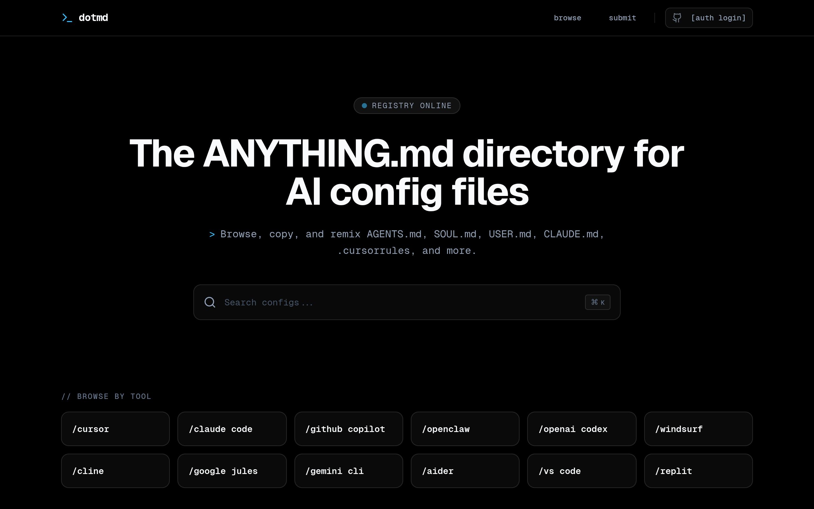
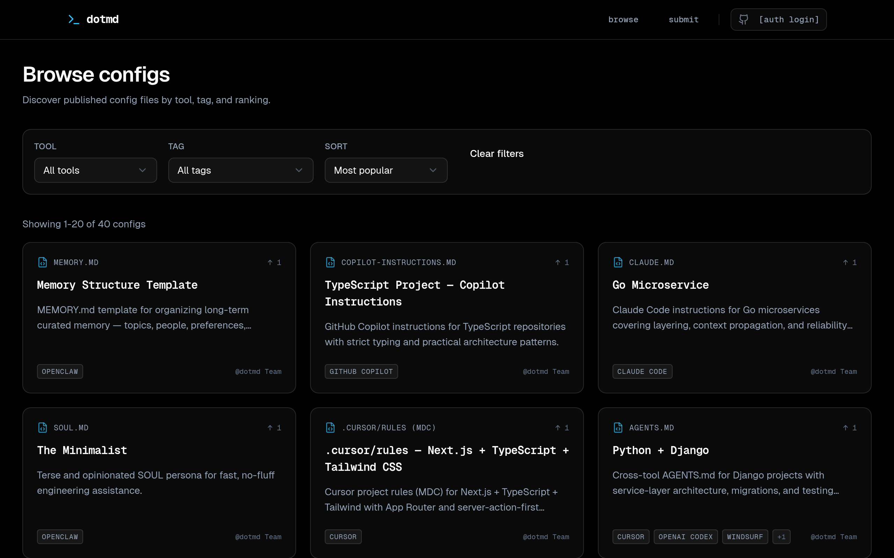
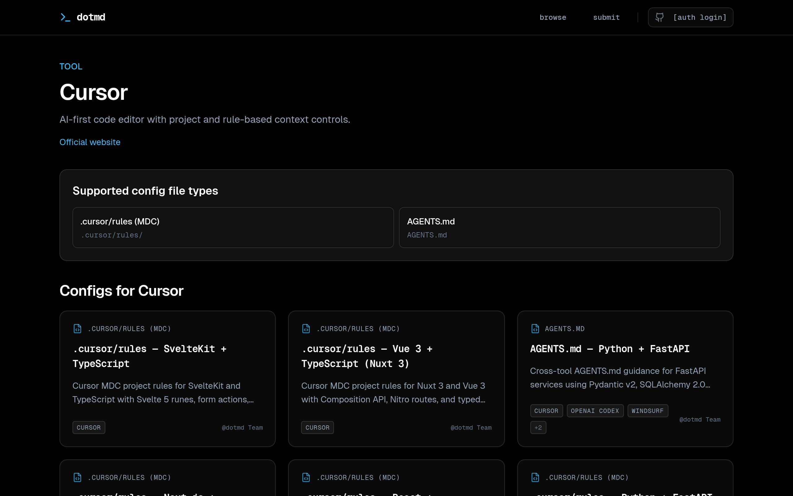
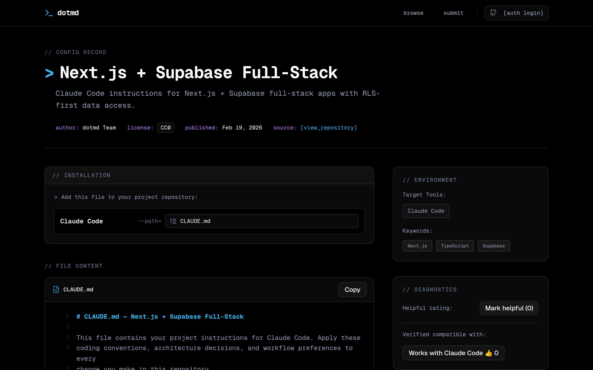
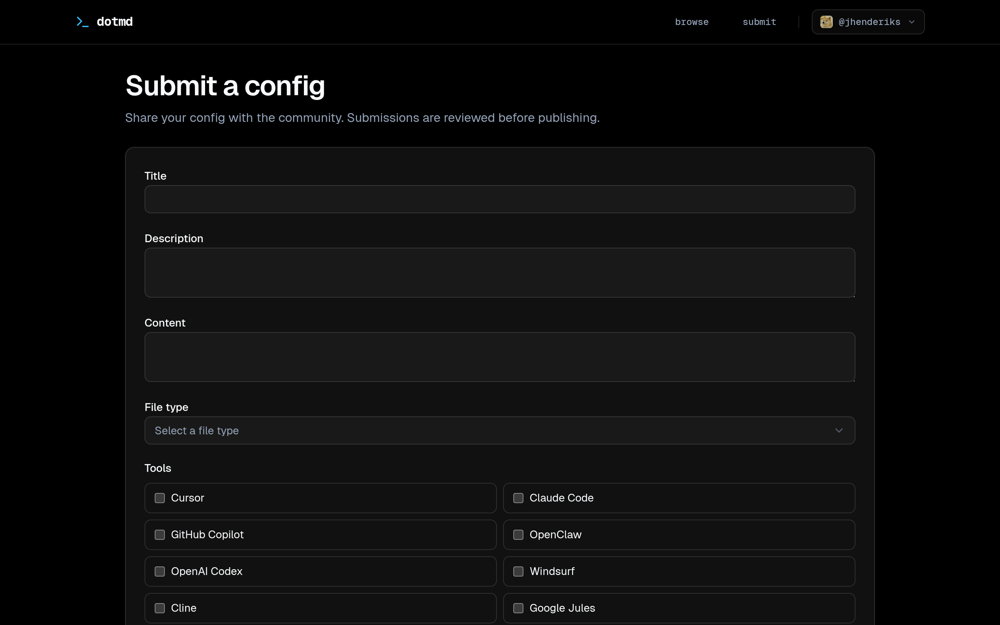

<div align="center">

# dotmd

The **ANYTHING.md** directory for AI config files.

Browse, copy, and remix AGENTS.md, CLAUDE.md, .cursorrules, SOUL.md, and more.

[](LICENSE)
[](https://github.com/pxlbyt-co/dotmd/stargazers)
[](https://dotmd.directory)

**[dotmd.directory](https://dotmd.directory)**



</div>

## What is dotmd?

Every AI coding tool has its own config format: `.cursorrules`, `CLAUDE.md`, `AGENTS.md`, `copilot-instructions.md`, `.windsurfrules`, `GEMINI.md`, `.clinerules`, `SOUL.md`, and more. dotmd is the place to discover, share, and remix all of them.

- **Browse** configs by tool, file type, framework, and use case
- **Copy** with one click and see exactly where to install them
- **Vote** on what works with tool-specific upvotes
- **Submit** your own configs via web form or GitHub PR



## Tool Pages

Each tool gets its own page with supported config file types and all available configs.



## Config Pages

Each config has install instructions, tool tags, and a full preview with syntax highlighting.



## Submit Your Own

Share your configs with the community. Submissions are reviewed before publishing.



## Tech Stack

- **Framework:** Next.js 15 (App Router) with Bun
- **Database + Auth:** Supabase (PostgreSQL + GitHub OAuth)
- **Hosting:** Vercel
- **Styling:** Tailwind CSS v4 + shadcn/ui
- **Linting:** Biome
- **Search:** PostgreSQL full-text search + trigram

## Getting Started

### Prerequisites

- [Bun](https://bun.sh/) (v1.2+)
- A [Supabase](https://supabase.com/) project (free tier works)

### Setup

```bash
git clone https://github.com/pxlbyt-co/dotmd.git
cd dotmd

bun install

cp .env.example .env.local
# Fill in your Supabase URL, anon key, and other values

bunx supabase db push

bun run dev
```

## Project Structure

```
src/
├── app/            # Next.js App Router pages
├── actions/        # Server actions (next-safe-action)
├── components/     # React components
├── lib/            # Utilities, Supabase clients, constants
└── types/          # TypeScript types

supabase/
└── migrations/     # Database migrations
```

## Contributing

Contributions welcome! Whether it's submitting configs, improving the codebase, or fixing bugs:

1. Fork the repo
2. Create a feature branch
3. Make your changes
4. Open a PR

For config submissions, the easiest path is the web form at [dotmd.directory/submit](https://dotmd.directory/submit).

## License

AGPL-3.0 — see [LICENSE](LICENSE)
